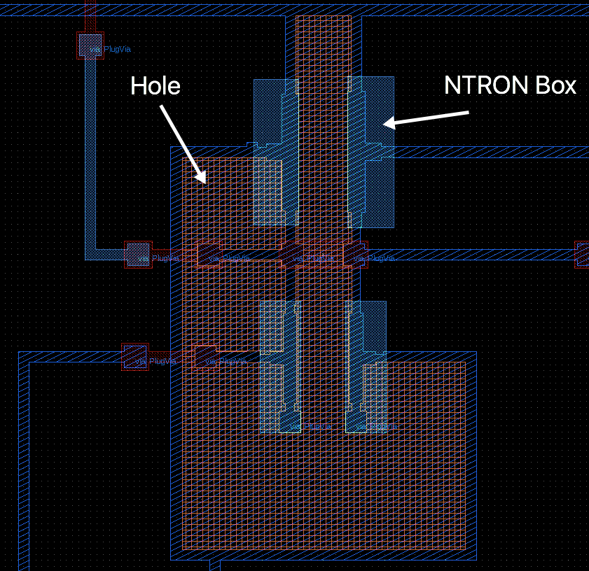

Baselayers
==========

The *baselayers* are the wiring layers that interconnect the different CellReferences
in the top-level cell that the user specified to extract. 

Hole detection
--------------

A problem arises with circuits containing devices that are not directly connected 
to ground. In the top-level cell all layers of the same type (gds number) are 
union together before being send to GMSH for meshing. The reason for explaining 
Method 1 which is deprecated is because it forms the basis of overcoming 
connection mistakes made by the designer. 

    
    Unified wire 42 (blue) creates a hole polygon (red) that has to be subtraction 
    from the mesh structure. NTRON boundary boxes are also shown for graph node detection.

Once the union operation on a layer type is completed it gives a list of polygon 
points and a list of booleans that is True if the corresponding polygon has an 
clockwise-orientation and False if it has a counterclockwise-orientation. 
Normal polygons are clockwise and hole-polygons are counterclockwise. 

When a hole-polygon is found in the unified wire layer we have to label this 
specific polygon to be subtracted from the final meshed structure, before 
sending it to GMSH for processing. Sometimes layer polygons of the same type 
overlap, therefore we also have to label the polygon list that has the 
hole-polygon inside it. This is done by adding the integer value of 99 to 
the gds number of that polygon layer. The hole-polygon’s gds number is 
increases by 100. To overcome the issue of having multiple holes inside 
one polygon layer we can link the hole-polygons with their pair polygon 
using the datatype variable from the GDS file structure. For instance, 
if one polygon of layer type 42 has a hole in it, it will have a key 
value of (99+42, 0) and the hole-polygon will be (100+42, 0). 

If a second polygon of the same type also has a hole it, it will have 
a key of (99+42, 1) and the hole-polygon will be (100+42, 1). 
This way when we want to send these polygons to the GMSH library 
we can find which layer type they are and which holes are connected 
to which polygons, without having to worry about polygon overlaps. 
Fig. 4 shows a wire polygon that creates a hole inside it. 
Not that the gds layer of the hole is different which separates 
the two so it can be send to GMSH.  
